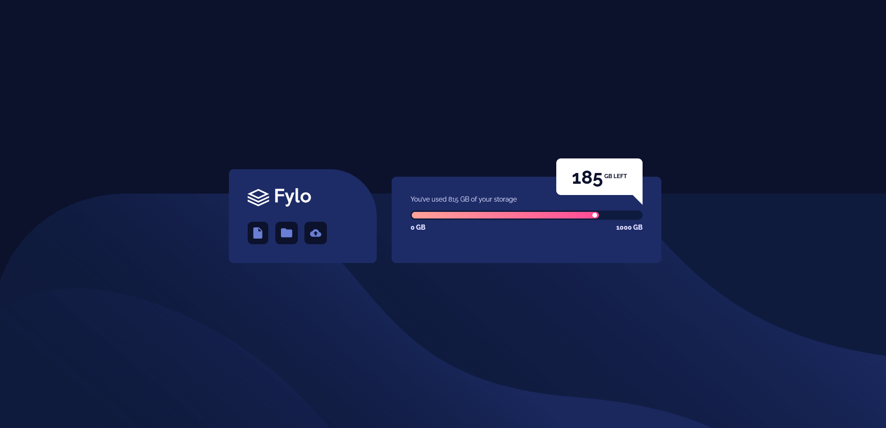

# Frontend Mentor - Fylo data storage component solution

This is a solution to the [Fylo data storage component challenge on Frontend Mentor](https://www.frontendmentor.io/challenges/fylo-data-storage-component-1dZPRbV5n). Frontend Mentor challenges help you improve your coding skills by building realistic projects.

## Table of contents

- [Overview](#overview)
  - [The challenge](#the-challenge)
  - [Screenshot](#screenshot)
  - [Links](#links)
- [My process](#my-process)
  - [Built with](#built-with)
  - [What I learned](#what-i-learned)
  - [Continued development](#continued-development)
  - [AI Collaboration](#ai-collaboration)
- [Author](#author)

## Overview

### The challenge

Users should be able to:

- View the optimal layout for the site depending on their device's screen size

### Screenshot

### Links

- Solution URL: 
- Live Site URL: 

## My process

### Built with

- Semantic HTML5 markup
- CSS custom properties
- Flexbox
- Mobile-first workflow
- The principle of modularity in CSS
- BEM naming convention

### What I learned

In this project, I learned and tried the following CSS practices for the 1st time:

- the modularity principle : seperating my css code to multiple files and folder, each specialzed in specific task or feature ( ex: componenets, layouts, base...). It was like a mini-CSS personal framwork ( like tailwind) that includes the pieces of code that repeated between projects. something I'm pround of! Ofcaurse, this is not aiming to repalce tailwind of CSS frameworks, I just find it fun to exerience the logic of how CSS frameworks work before moving to them in next projects.

- How to custom-style the <progress> elemtent

- How to use pseudo-element selectors to add irregular shapes to divs or components

### Continued development

- pixel accurate UI ( UI that matchs the desing pixel by pixel)
- Accebility

### AI Collaboration

- I just used Google AI ( gemini ), instead of basic google search
- I think I need to learn using an AI copilot ( in VS code directly ) in next projects to improve the work flow

## Author

- Frontend Mentor - [@Salah792](https://www.frontendmentor.io/profile/Salah792)
